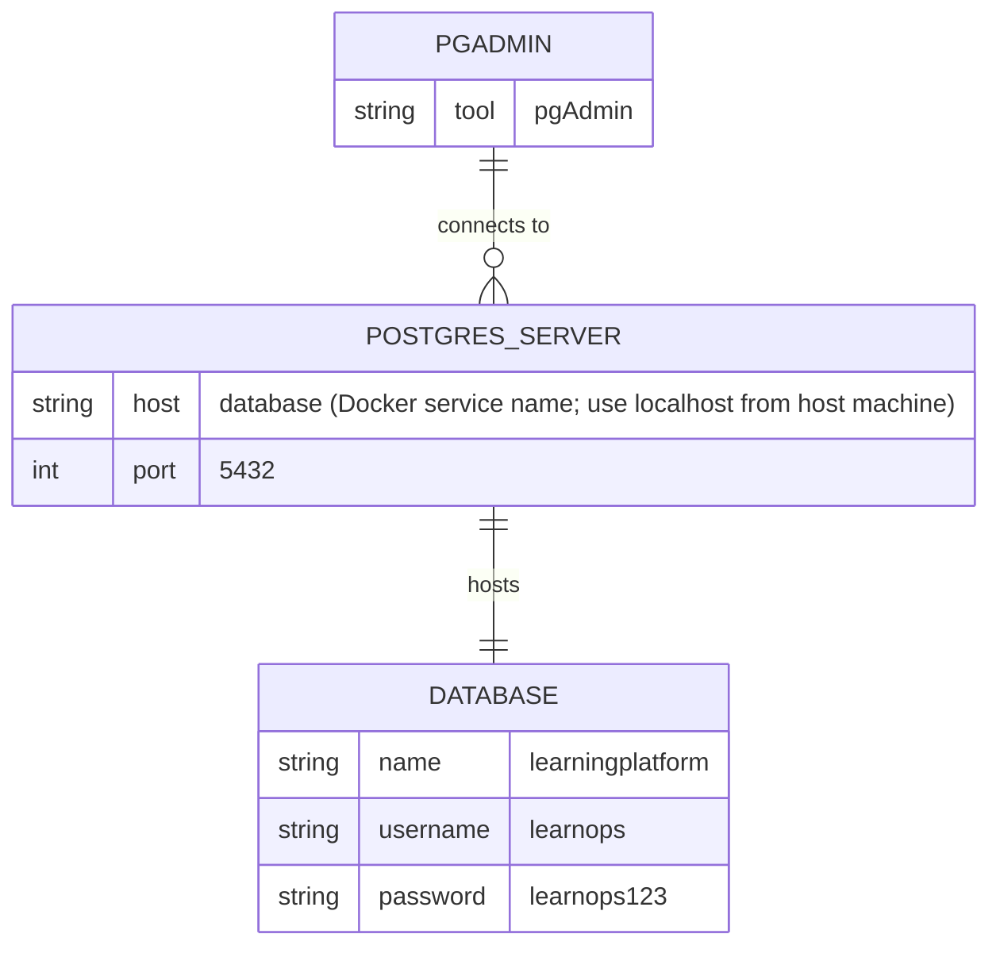

# Data Model (AI)

## 1. Database Diagram

Mermaid diagrams are embedded directly in markdown using a fenced code block with the `mermaid` language tag:

Connection details sourced from `learn-ops-api/.env` (see `learn-ops-api/.env.template` for the same defaults):

> Note: `LEARN_OPS_HOST=database` is the Docker Compose service/network hostname, resolvable only from other containers on the same network. When connecting from pgAdmin running on the host machine, use `localhost` (or `127.0.0.1`) with the port that container `5432` is published to.

## 2. Database Info

**Database type:**

**ORM:**

## 3. Model to Table Mapping

| Model Name | Table Name |
|------------|------------|
|            |            |

| Property Name | Column Name | Data Type |
|---------------|-------------|-----------|
|               |             |           |

## 4. Relationship Examples

**One-to-one** (field name: )

**One-to-many** (field name: )

**Many-to-many** (field name: )
