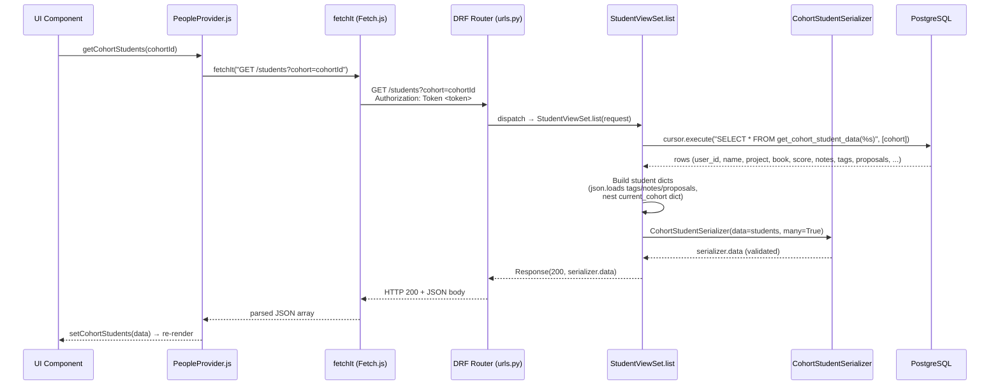

# Trace: students (LearningAPI)

### Request path table from Claude

Tracing the `GET /students?cohort=<id>` flow — the primary list path used by the cohort dashboard.

| Layer | File | Class / Function | What it does |
|-------|------|-----------------|--------------|
| UI component | `learn-ops-client/src/components/people/PeopleProvider.js:25` | `getCohortStudents` | React context function that calls `fetchIt(GET /students?cohort=<id>)` and stores the result in `cohortStudents` state |
| API helper | `learn-ops-client/src/components/utils/Fetch.js` | `fetchIt` | Attaches the user's auth token as an `Authorization: Token <token>` header, executes `fetch()`, and returns parsed JSON |
| URL router | `learn-ops-api/LearningPlatform/urls.py:48` | `router.register(r'students', StudentViewSet)` | DRF `DefaultRouter` routes `GET /students` to `StudentViewSet`; query params are passed through to the view |
| View | `learn-ops-api/LearningAPI/views/student_view.py:160` | `StudentViewSet.list` | Reads the `?cohort` query param, opens a raw DB cursor, calls the `get_cohort_student_data` PostgreSQL function, then assembles result dicts (parsing JSON fields for tags, notes, proposals) |
| Serializer | `learn-ops-api/LearningAPI/views/student_view.py:571` | `CohortStudentSerializer` | Flat `Serializer` (not `ModelSerializer`) that validates the list of student dicts returned from the DB function before sending the response |
| DB | `learn-ops-api/LearningAPI/views/student_view.py:181` | `connection.cursor().execute(...)` | Calls the PostgreSQL stored function `get_cohort_student_data(%s)` with the cohort ID; returns columns including name, project, book, score, tags, notes, and proposals |
| UI refresh | `learn-ops-client/src/components/people/PeopleProvider.js:28` | `setCohortStudents(data)` | Updates `cohortStudents` React state in `PeopleContext`; all components consuming this context re-render with the new student list |

> **Note:** For `GET /students/<id>` (single student), the view uses `StudentSerializer` (a `ModelSerializer` on `NssUser`) which lazily fetches learning records, core skill records, and project via additional ORM queries on the model's properties.

---

### Sequence Diagram

