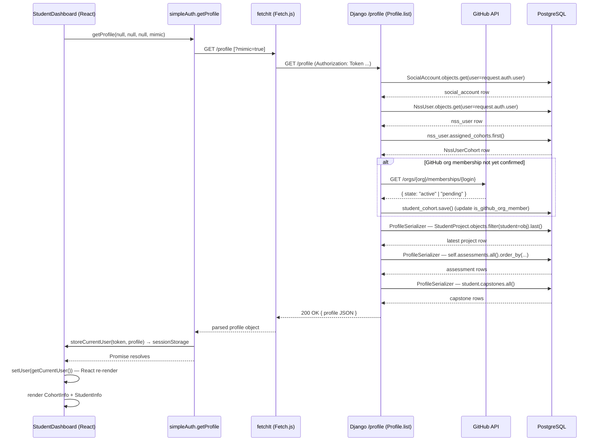

# Trace Notes (AI): StudentDashboard (learn-ops-client)

### Request path table from Claude

## Request Path

| Layer | File | Class / Function | What it does |
|-------|------|-----------------|--------------|
| UI component | `learn-ops-client/src/components/dashboard/student/StudentDashboard.js` | `StudentDashboard` | Top-level component; on mount calls `getProfile()` to fetch user data, then conditionally renders `CohortInfo` + `StudentInfo` or a blocking message (pending GitHub invite / missing name) |
| API helper | `learn-ops-client/src/components/auth/simpleAuth.js` | `getProfile` | Builds the `GET /profile` URL (appending `?mimic=true` if staff is mimicking a student), calls `fetchIt`, then stores the returned profile in `sessionStorage` via `storeCurrentUser` |
| HTTP utility | `learn-ops-client/src/components/utils/Fetch.js` | `fetchIt` | Attaches the `Authorization: Token <token>` header from `sessionStorage`, then calls the browser `fetch` API; handles 200/201/204 responses and surfaces JSON error bodies as thrown Errors |
| URL router | `learn-ops-api/LearningPlatform/urls.py` | `router.register(r'profile', views.Profile)` | DRF DefaultRouter maps `GET /profile` → `Profile.list` and `PUT /profile/change` → `Profile.change` |
| View | `learn-ops-api/LearningAPI/views/profile.py` | `Profile.list` | Looks up the `SocialAccount` and `NssUser` for the authenticated user; checks GitHub org membership via GitHub API if needed; delegates to `ProfileSerializer` for student users |
| Serializer | `learn-ops-api/LearningAPI/views/profile.py` | `ProfileSerializer` | Builds the JSON response from `NssUser`; calls `get_project`, `get_capstones`, `get_name`, `get_github`, and `get_email` as `SerializerMethodField` helpers |
| DB | `learn-ops-api/LearningAPI/models/people/nssuser.py` | `NssUser` model + `assessment_overview` / `current_cohort` properties | `assessment_overview` queries `self.assessments.all().order_by(...)` ; `current_cohort` queries `self.assigned_cohorts.order_by("-id").last()` and joins to `CohortInfo`, returning dates, GitHub org URL, and course list |
| UI refresh | `learn-ops-client/src/components/auth/simpleAuth.js` | `storeCurrentUser` → `getCurrentUser` | After the fetch resolves, the profile is LZW-compressed and written back to `sessionStorage`; `setUser(getCurrentUser())` triggers a React re-render which replaces the "Loading…" placeholder with `CohortInfo` + `StudentInfo` |

---

### Sequence Diagram

